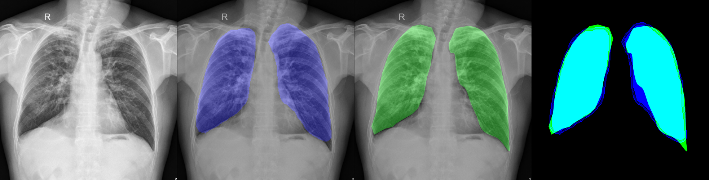

# Few-Shot Image Semantic Segmentation
* Experiment for few-shot segmentation:
    * Model was trained using FSS-100 dataset and tested using Lung Segmentation dataset.
    * blue=>prediction, green=>ground truth
    

## reference
* Reference paper: [PANet](http://openaccess.thecvf.com/content_ICCV_2019/papers/Wang_PANet_Few-Shot_Image_Semantic_Segmentation_With_Prototype_Alignment_ICCV_2019_paper.pdf) 
* Original code: [https://github.com/kaixin96/PANet](https://github.com/kaixin96/PANet)

## dataset
* [FSS-1000](https://github.com/HKUSTCV/FSS-1000)
* [Lung segmentation from CXR](https://www.kaggle.com/yoctoman/shcxr-lung-mask)
